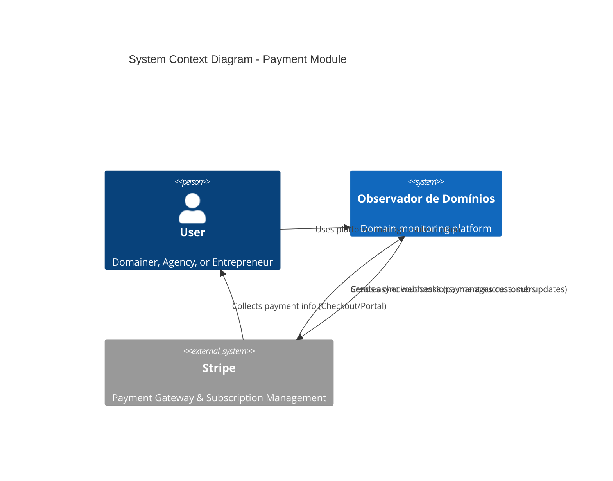
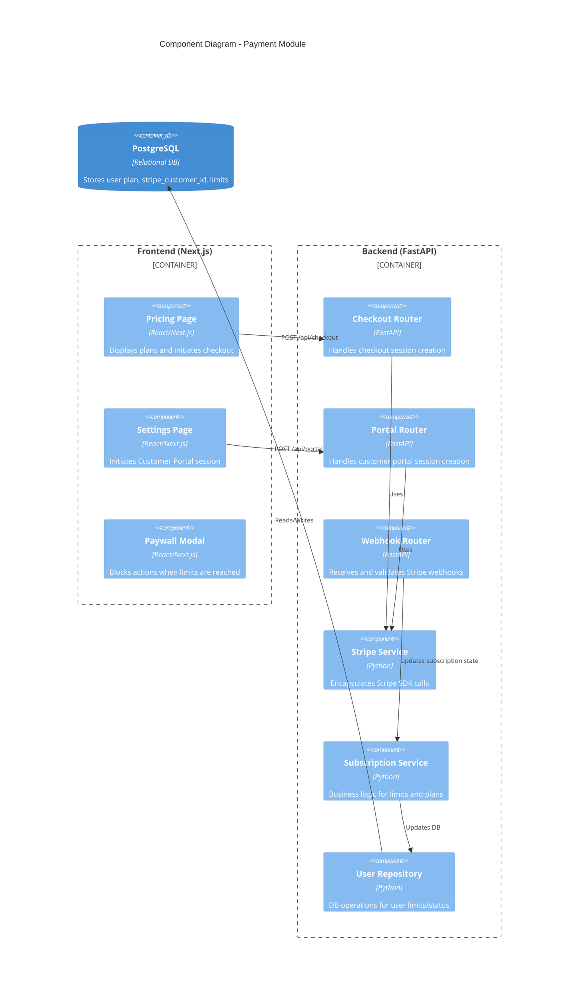
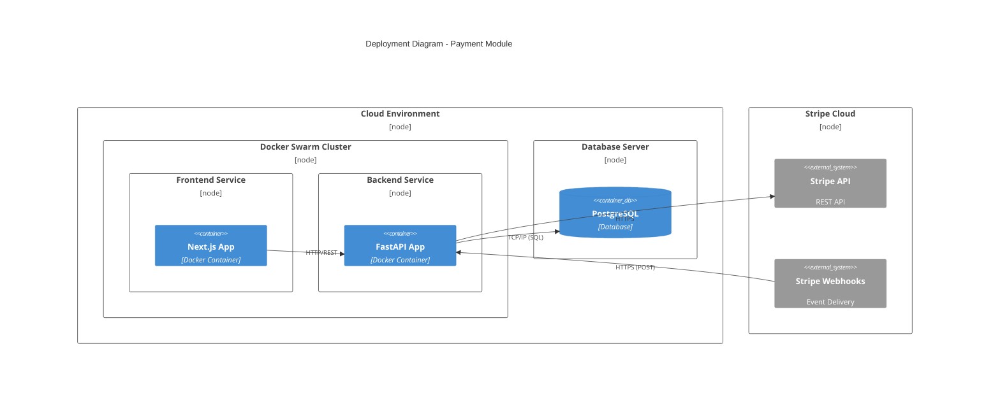
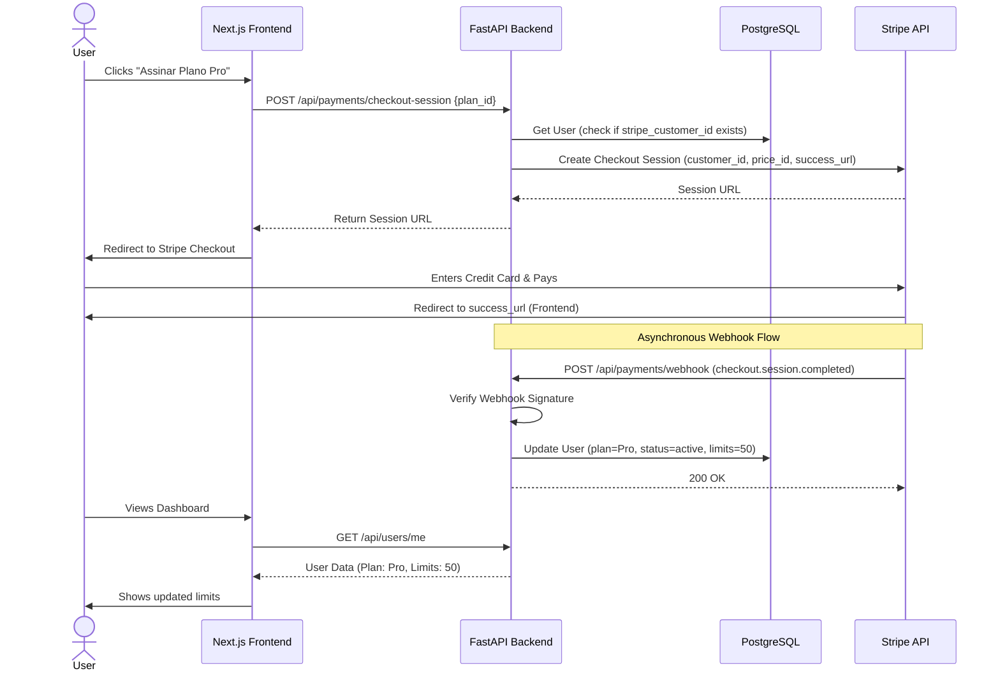

# Observador de Domínios (Módulo de Pagamentos) - Architecture Plan

## Executive Summary
Este documento detalha a arquitetura e o plano de implementação para o módulo de pagamentos e assinaturas do Observador de Domínios. A solução utilizará a infraestrutura do Stripe (Checkout Sessions, Customer Portal e Billing) para gerenciar a monetização da plataforma de forma segura, escalável e com baixo esforço operacional, garantindo que nenhum dado sensível de cartão de crédito transite pelos servidores da aplicação.

## System Context



**Overview**: O diagrama de contexto mostra as interações de alto nível entre o usuário, a plataforma Observador de Domínios e o gateway de pagamento Stripe.
**Key Components**: 
- **User**: O cliente final que deseja monitorar domínios.
- **Observador de Domínios**: Nossa plataforma principal.
- **Stripe**: Sistema externo responsável por processar pagamentos, gerenciar recorrências e hospedar as interfaces de checkout e portal do cliente.
**Relationships**: A plataforma delega a coleta de dados de pagamento e a gestão da assinatura para o Stripe. O Stripe notifica a plataforma sobre mudanças de estado (ex: pagamento aprovado, assinatura cancelada) via Webhooks assíncronos.
**Design Decisions**: O uso do Stripe Checkout e Customer Portal (Hosted Pages) foi escolhido para reduzir o escopo de conformidade PCI-DSS e acelerar o tempo de desenvolvimento (Time-to-Market).

## Component Architecture



**Overview**: Detalhamento dos componentes internos do Frontend e Backend necessários para suportar o fluxo de pagamentos.
**Key Components**:
- **Frontend**: Páginas de Pricing, Configurações e componentes de Paywall (bloqueio por limite).
- **Backend**: Routers específicos para pagamentos e webhooks, serviços de negócio isolados (`StripeService`, `SubscriptionService`) e repositório de dados.
**Design Decisions**: Separação clara de responsabilidades no backend. O `StripeService` lida exclusivamente com a comunicação com a API do Stripe, enquanto o `SubscriptionService` aplica as regras de negócio locais (ex: atualizar limites no banco).

## Deployment Architecture



**Overview**: Como os componentes serão implantados na infraestrutura existente baseada em Docker Swarm.
**Key Components**: Containers Docker para Frontend e Backend, banco de dados PostgreSQL e a nuvem do Stripe.
**NFR Considerations**: O endpoint de Webhooks no Backend deve estar exposto publicamente (via HTTPS/Load Balancer) para que o Stripe consiga entregar os eventos.

## Data Flow

```mermaid
flowchart TD
    subgraph User
        U[User Browser]
    end
    
    subgraph Observador de Domínios
        F[Frontend Next.js]
        B[Backend FastAPI]
        DB[(PostgreSQL)]
    end
    
    subgraph Stripe
        SC[Stripe Checkout]
        SA[Stripe API]
        SW[Stripe Webhooks]
    end
    
    U -->|1. Selects Plan| F
    F -->|2. Request Checkout| B
    B -->|3. Create Session| SA
    SA -->|4. Session URL| B
    B -->|5. Redirect URL| F
    F -->|6. Redirects| SC
    U -->|7. Enters Payment Info| SC
    SC -->|8. Payment Success| SA
    SA -->|9. Async Event| SW
    SW -->|10. Webhook (checkout.session.completed)| B
    B -->|11. Update User Plan & Limits| DB
    SC -->|12. Redirect back to App| F
```

**Overview**: O fluxo de dados desde a seleção do plano até a confirmação do pagamento e atualização do banco de dados.
**Design Decisions**: O fluxo de atualização do banco de dados (Passos 9 a 11) ocorre de forma assíncrona via Webhooks. Isso garante que a aplicação não dependa do redirecionamento do usuário (Passo 12) para efetivar a assinatura, evitando falhas caso o usuário feche o navegador antes do redirecionamento.

## Key Workflows



**Overview**: Diagrama de sequência detalhando as chamadas de API e a ordem cronológica das operações durante a assinatura de um plano.
**Risks and Mitigations**: O webhook pode chegar antes ou depois do redirecionamento do usuário. O frontend deve estar preparado para fazer polling ou exibir um estado de "Processando pagamento" caso o banco de dados ainda não tenha sido atualizado pelo webhook quando o usuário retornar à aplicação.

## Phased Development & Task Breakdown

Para implementar esta arquitetura de forma segura e iterativa, o desenvolvimento deve ser dividido nas seguintes fases e tarefas:

### Fase 1: Configuração e Modelagem de Dados (Setup)
1. **Stripe Dashboard**: Criar conta no Stripe, configurar os Produtos (ex: Plano Pro) e Preços (Mensal/Anual) no ambiente de Teste.
2. **Variáveis de Ambiente**: Configurar `STRIPE_SECRET_KEY`, `STRIPE_PUBLISHABLE_KEY` e `STRIPE_WEBHOOK_SECRET` no `.env` do backend e frontend.
3. **Modelagem de Banco de Dados (Backend)**:
   - Atualizar o modelo SQLAlchemy `User` adicionando as colunas: `stripe_customer_id` (string, nullable, unique), `stripe_subscription_id` (string, nullable, unique), `plan_id` (string, default='free'), `subscription_status` (string, default='active').
   - Gerar e aplicar a migration via Alembic (`alembic revision --autogenerate -m "add stripe fields"`).

### Fase 2: Backend - Integração Core e Webhooks
1. **Stripe Service**: Criar `backend/app/services/stripe_service.py` para encapsular a lógica do SDK do Stripe (criar customer, criar checkout session, criar portal session).
2. **Endpoints de Pagamento**: Criar `backend/app/api/payments.py` com as rotas:
   - `POST /checkout-session`: Recebe o ID do plano, cria/recupera o Customer no Stripe e retorna a URL do Checkout.
   - `POST /customer-portal`: Retorna a URL do portal de autoatendimento do Stripe.
3. **Endpoint de Webhooks**:
   - Criar `POST /webhook` em `payments.py`.
   - Implementar a verificação rigorosa da assinatura do webhook (`stripe.Webhook.construct_event`).
   - Implementar handlers para os eventos essenciais:
     - `checkout.session.completed`: Ativa a assinatura e atualiza o plano do usuário.
     - `customer.subscription.updated`: Lida com upgrades/downgrades.
     - `customer.subscription.deleted`: Reverte o usuário para o plano Free.

### Fase 3: Frontend - UI e Redirecionamentos
1. **Página de Pricing**: Criar `frontend/app/pricing/page.tsx` exibindo os planos disponíveis.
2. **Integração de Checkout**: Adicionar botões na página de Pricing que chamam o endpoint `/checkout-session` do backend e redirecionam o usuário (`window.location.href = url`).
3. **Páginas de Retorno**: Criar `frontend/app/payment/success/page.tsx` e `frontend/app/payment/cancel/page.tsx`.
4. **Portal do Cliente**: Na página de configurações do usuário, adicionar o botão "Gerenciar Assinatura" que chama `/customer-portal` e redireciona.

### Fase 4: Enforcement de Limites (Paywall)
1. **Backend Logic**: No serviço de criação de domínios (`backend/app/services/domain_service.py`), adicionar verificação: contar domínios atuais do usuário e comparar com o limite do seu `plan_id`.
2. **Tratamento de Erro**: Se o limite for excedido, lançar uma exceção HTTP 403 (Forbidden) com um código de erro específico (ex: `LIMIT_EXCEEDED`).
3. **Frontend Paywall**: Interceptar o erro 403 no frontend ao tentar adicionar um domínio e exibir um Modal/Dialog amigável sugerindo o upgrade para o plano Pro.

## Non-Functional Requirements Analysis

### Scalability
A delegação do processamento de pagamentos para o Stripe garante que a aplicação não sofra gargalos durante picos de assinaturas. O processamento de webhooks deve ser rápido; operações pesadas decorrentes de webhooks devem ser enviadas para background tasks (ex: Celery ou `BackgroundTasks` do FastAPI).

### Security
- **PCI Compliance**: Nenhum dado de cartão de crédito toca os servidores da aplicação.
- **Webhook Security**: Validação obrigatória da assinatura criptográfica do Stripe para evitar falsificação de eventos de pagamento.
- **Idempotência**: O processamento de webhooks deve ser idempotente para lidar com possíveis reenvios de eventos pelo Stripe sem causar inconsistências no banco de dados.

### Reliability
O uso de webhooks assíncronos garante que falhas temporárias de rede entre o usuário e a aplicação após o pagamento não resultem em perda de estado da assinatura. O Stripe possui políticas automáticas de retentativa de webhooks em caso de falha do nosso servidor.

## Risks and Mitigations

| Risco | Impacto | Mitigação |
|-------|---------|-----------|
| Webhook falhar ou atrasar | Alto (Usuário paga mas não recebe o plano) | Implementar polling no frontend na página de sucesso; garantir que o endpoint de webhook responda 200 OK rapidamente e processe a lógica em background se necessário. |
| Inconsistência de estado | Médio | Criar um script de reconciliação (CRON job) que verifica periodicamente o status das assinaturas ativas no Stripe contra o banco de dados local. |
| Abuso do endpoint de Webhook | Alto | Validação estrita da assinatura do Stripe (`stripe-signature` header) e rate limiting no endpoint. |

## Technology Stack Recommendations
- **Backend**: `stripe-python` (SDK oficial).
- **Frontend**: Redirecionamento nativo (não é estritamente necessário usar `@stripe/stripe-js` se usarmos apenas Hosted Checkout Sessions, o que simplifica a implementação).
- **Testes Locais**: Uso do `Stripe CLI` (`stripe listen --forward-to localhost:8000/api/payments/webhook`) para testar webhooks no ambiente de desenvolvimento local.

## Next Steps
1. Obter respostas para as "Perguntas de Clarificação" listadas no PRD (Modelagem de preços, recorrência, trial, etc).
2. Criar a conta no Stripe e configurar os produtos em modo de teste.
3. Iniciar a Fase 1 (Modelagem de Banco de Dados) conforme o Task Breakdown.
